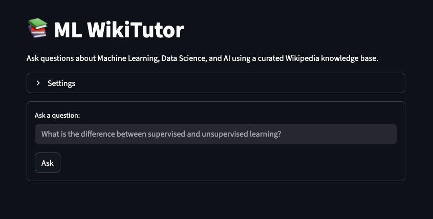

# ML WikiTutor (RAG Prototype)



A lightweight **Retrieval-Augmented Generation (RAG)** prototype that lets you “chat” with a curated Machine Learning / Data Science / AI knowledge base built from Wikipedia articles.

- **Vector DB:** Zvec (local, file-based)
- **Embeddings:** OpenAI (`text-embedding-3-small`)
- **LLM:** OpenAI chat model (via `langchain_openai`)
- **UI:** Streamlit
- **Language:** Python (managed with [`uv`](https://docs.astral.sh/uv/))

---

## What this project does

When you ask a question, the app:

1. Embeds your query using OpenAI embeddings  
2. Retrieves the most relevant chunks from a local Zvec vector index  
3. Builds a grounded context window from those chunks  
4. Uses an OpenAI chat model to generate an answer **only from the retrieved context**  
5. Shows sources and previews for transparency

If the answer cannot be supported by the retrieved context, the system responds with:

> `I don't have that information in my sources.`

---

## Dataset scale 

The knowledge base is built from a curated title list of Wikipedia articles related to ML/DS/AI.

After ingestion and chunking:

- Total chunks: **2,747**
- Total tokens: **1,068,656**

---

## Solution architecture 

### Components

**1) Ingestion**
- Reads Wikipedia titles from `data_raw/titles.txt`
- Fetches page extracts via the Wikipedia API
- Splits documents into chunks (~500 tokens with overlap)
- Writes chunks to `data_processed/chunks.jsonl`

**2) Indexing**
- Reads `data_processed/chunks.jsonl`
- Generates embeddings for each chunk using OpenAI
- Stores vectors + metadata in a local Zvec collection under `index/zvec_wiki_ml`

**3) Retrieval**
- For a user question, compute query embedding
- Run similarity search in Zvec (cosine distance)
- Select a diverse set of results (reduce duplicates)
- Build a bounded context window with numbered citations

**4) Generation**
- Send the bounded context + question to the LLM
- Enforce grounding: answer using *only* provided context
- Return answer + citations

**5) UI**
- Streamlit front-end in `app.py`
- Form submission enabled (Enter key works)
- Displays answer, confidence, sources, and optional debug panels (hidden on refusals)

### Data flow

`titles.txt` → `ingest_wiki_api.py` → `chunks.jsonl` → `index_zvec.py` → `Zvec index` → `retrieve.py` → `rag.py` → `Streamlit app`

---

## Project structure

```
├── app.py
├── src/
│   ├── __init__.py
│   ├── chunk.py
│   ├── ingest_wiki_api.py
│   ├── index_zvec.py
│   ├── retrieve.py
│   ├── rag.py
│   └── eval_run.py
├── data_raw/
│   └── titles.txt
├── data_processed/
│   └── chunks.jsonl              # generated
├── index/
│   └── zvec_wiki_ml/             # generated
├── scripts/
│   ├── rebuild_index.sh
│   └── smoke_*.py                # optional smoke tests
└── eval/
    ├── questions.jsonl
    └── results.jsonl             # ignored

```

---

## Getting started

### 1) Clone the repo

```
git clone https://github.com/asianvader/ml-wikitutor-rag.git
cd ml-wikitutor-rag
```

### 2) Install `uv`
```
pip install uv
```

### 3) Create a .env file

Create a file named .env in the project root:

```
touch .env
```

#### Add your OpenAI API key:

```
OPENAI_API_KEY="your_openai_api_key_here"
```

#### Add your .env file to .gitignore

### 4) Install dependencies

```
uv sync
```

---

### 5) Build the knowledge base (ingest + index)

#### One-command rebuild
```
./scripts/rebuild_index.sh
```

This will:

Fetch Wikipedia pages and write `data_processed/chunks.jsonl`

Build a fresh Zvec vector index under `index/zvec_wiki_ml`

---
### 6) Run the App
```
uv run streamlit run app.py
```

---
## Notes / limitations

* Wikipedia content is fetched via API at build time; results depend on availability and page redirects.
* The RAG prompt enforces grounding; if coverage is missing, the model will refuse rather than hallucinate.
* Zvec is local; index artifacts are stored under index/ and should not be committed.

---
## References

This project builds upon the following tools and technologies:

- **OpenAI API** – Embeddings and chat model used for retrieval and answer generation  
  https://platform.openai.com/docs/

- **LangChain (langchain_openai)** – LLM + embedding integration  
  https://python.langchain.com/

- **Zvec** – Local vector database used for semantic search  
  https://github.com/zilliztech/zvec

- **Streamlit** – Web interface for the RAG application  
  https://streamlit.io/

- **Wikipedia API** – Source of ML/DS/AI knowledge base content  
  https://www.mediawiki.org/wiki/API:Main_page