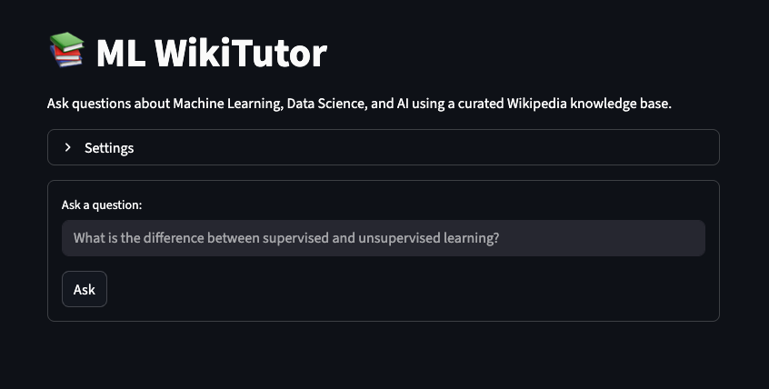

# ML WikiTutor (RAG Prototype)



A lightweight **Retrieval-Augmented Generation (RAG)** prototype that lets you "chat" with a curated Machine Learning / Data Science / AI knowledge base built from Wikipedia articles.

- **Vector DB:** Qdrant Cloud
- **Embeddings:** OpenAI (`text-embedding-3-small`)
- **LLM:** OpenAI chat model (via `langchain_openai`)
- **UI:** Streamlit (deployed on Streamlit Community Cloud)
- **Language:** Python (managed with [`uv`](https://docs.astral.sh/uv/))

---

## What this project does

When you ask a question, the app:

1. Embeds your query using OpenAI embeddings
2. Retrieves the most relevant chunks from a Qdrant Cloud vector collection
3. Builds a grounded context window from those chunks
4. Uses an OpenAI chat model to generate an answer **only from the retrieved context**
5. Shows sources and previews for transparency

If the answer cannot be supported by the retrieved context, the system responds with:

> `I don't have that information in my sources.`

---

## Dataset scale

The knowledge base is built from a curated title list of Wikipedia articles related to ML/DS/AI.

After ingestion and chunking:

- Total chunks: **23,124**
- Total tokens: **~9M+**

---

## Solution architecture

### Components

**1) Ingestion**
- Reads Wikipedia titles from `data_raw/titles.txt`
- Fetches page extracts via the Wikipedia API
- Splits documents into chunks (~500 tokens with overlap)
- Writes chunks to `data_processed/chunks.jsonl`

**2) Indexing**
- Reads `data_processed/chunks.jsonl`
- Generates embeddings for each chunk using OpenAI
- Upserts vectors + metadata into a Qdrant Cloud collection via `src/index_qdrant.py`

**3) Retrieval**
- For a user question, compute query embedding
- Run similarity search in Qdrant Cloud (cosine distance)
- Select a diverse set of results (reduce duplicates)
- Build a bounded context window with numbered citations

**4) Generation**
- Send the bounded context + question to the LLM
- Enforce grounding: answer using *only* provided context
- Return answer + citations

**5) UI**
- Streamlit front-end in `app.py`
- Form submission enabled (Enter key works)
- Displays answer, confidence, sources, and optional debug panels (hidden on refusals)

### Data flow

`titles.txt` → `ingest_wiki_api.py` → `chunks.jsonl` → `index_qdrant.py` → `Qdrant Cloud` → `retrieve.py` → `rag.py` → `Streamlit app`

---

## Project structure

```
├── app.py
├── requirements.txt
├── src/
│   ├── __init__.py
│   ├── chunk.py
│   ├── ingest_wiki_api.py
│   ├── index_qdrant.py
│   ├── vector_store.py
│   ├── retrieve.py
│   ├── rag.py
│   └── eval_run.py
├── data_raw/
│   └── titles.txt
├── data_processed/
│   └── chunks.jsonl              # generated
├── scripts/
│   ├── rebuild_index.sh
│   └── smoke_*.py                # optional smoke tests
└── eval/
    ├── questions.jsonl
    └── results.jsonl             # ignored
```

---

## Getting started

### 1) Clone the repo

```
git clone https://github.com/asianvader/ml-wikitutor-rag.git
cd ml-wikitutor-rag
```

### 2) Install `uv`
```
pip install uv
```

### 3) Create a .env file

Create a file named `.env` in the project root and add your credentials:

```
OPENAI_API_KEY="your_openai_api_key_here"
QDRANT_URL="https://your-cluster-id.cloud.qdrant.io:6333"
QDRANT_API_KEY="your_qdrant_api_key_here"
```

### 4) Install dependencies

```
uv sync
```

---

### 5) Build the knowledge base (ingest + index)

#### One-command rebuild
```
./scripts/rebuild_index.sh
```

This will:
- Fetch Wikipedia pages and write `data_processed/chunks.jsonl`
- Embed all chunks and upsert them into the `wiki_ml_token` Qdrant collection

---

### 6) Run the app locally
```
uv run streamlit run app.py
```

---

## Chunking strategies

Three strategies are available, selectable in the app's Settings panel:

| Strategy | Description | Best for |
|----------|-------------|----------|
| **Token** (default) | Fixed-size chunks (~500 tokens, 80-token overlap) | General use; fastest to build |
| **Semantic** | Splits at points where meaning shifts, using embedding similarity | Questions where topic boundaries matter |
| **Parent-Child** | Small child chunks indexed for precision; the parent chunk (~500 tok) is returned to the LLM | Questions needing broader context around a specific fact |

Each strategy has its own Qdrant collection (`wiki_ml_token`, `wiki_ml_semantic`, `wiki_ml_parent_child`) and a corresponding rebuild script:

```
bash scripts/rebuild_index.sh               # token
bash scripts/rebuild_index_semantic.sh      # semantic
bash scripts/rebuild_index_parent_child.sh  # parent-child
```

---

## Multi-query retrieval

Enable **Multi-Query retrieval** in the Settings panel to generate 3 alternative rephrasings of your question using an LLM, run each through the vector index, then merge and deduplicate the results.

**Trade-off:** improves recall for vague or informally phrased questions at the cost of one extra LLM call per query. For well-formed, specific questions the default single-query mode performs equally well.

---

## Evaluation

The project includes a full evaluation suite covering retrieval quality, answer quality, and confidence calibration.

### Retrieval eval

```
uv run python -m src.eval_retrieval
```

Reports **Precision@k**, **Recall@k**, **Hit Rate**, and **MRR** against a labelled question set.

### Generation eval

```
uv run python -m src.eval_generation
```

Uses an LLM-as-judge (GPT-4.1) to score answers on **Faithfulness** (is every claim grounded in the retrieved context?) and **Answer Relevance** (does the answer address the question?), both on a 1–5 scale.

### Confidence calibration

```
uv run python -m src.eval_calibration
```

Groups generation results by confidence label (High / Medium / Low) and reports average faithfulness and relevance per tier. Key finding: confidence tracks *retrieval quality*, not answer quality — all tiers score 4.9–5.0 faithfulness, but low-confidence answers reflect weaker or more distant retrieval.

### Eval question set

`eval/questions.jsonl` contains **44 ML questions** (covering core concepts, niche topics, and cross-domain questions) plus **6 refusal questions** (off-topic queries that should be declined). The refusal questions verify the ML-only restriction is correctly enforced.

---

## Streamlit Community Cloud deployment

1. Connect the repo at [share.streamlit.io](https://share.streamlit.io), set main file to `app.py`
2. In **App settings → Secrets**, add:

```toml
OPENAI_API_KEY = "sk-..."
QDRANT_URL = "https://your-cluster..."
QDRANT_API_KEY = "your-key..."
```

3. Deploy — no other configuration needed.

---

## Notes / limitations

* Wikipedia content is fetched via API at build time; results depend on availability and page redirects.
* The RAG prompt enforces grounding; if coverage is missing, the model will refuse rather than hallucinate.
* Qdrant collections are cloud-hosted; no local index artifacts are needed or committed.

---

## Branches

| Branch | Purpose |
|--------|---------|
| `main` | Current development branch (Qdrant Cloud vector store) |
| `legacy/zvec` | Preserves the original Zvec (local, file-based) implementation before the migration to Qdrant Cloud |

---

## References

This project builds upon the following tools and technologies:

- **OpenAI API** – Embeddings and chat model used for retrieval and answer generation
  https://platform.openai.com/docs/

- **LangChain (langchain_openai)** – LLM + embedding integration
  https://python.langchain.com/

- **Qdrant** – Cloud vector database used for semantic search
  https://qdrant.tech/

- **Streamlit** – Web interface for the RAG application
  https://streamlit.io/

- **Wikipedia API** – Source of ML/DS/AI knowledge base content
  https://www.mediawiki.org/wiki/API:Main_page
